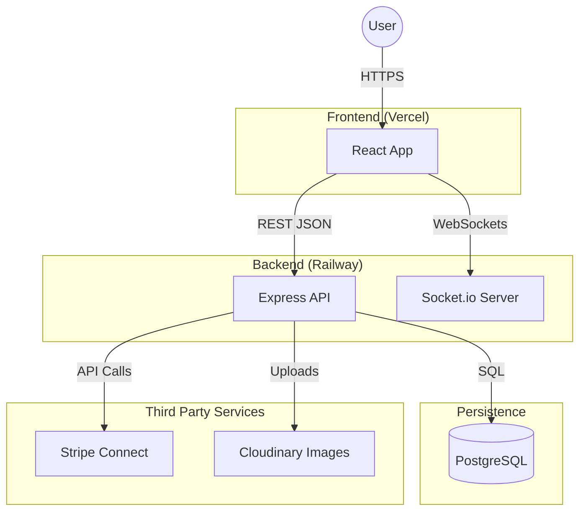

# # System Architecture document
**Project:** Adelaide Uni Eats  
**Team:** Taishi Morgan, Sam Lotus  
**Version:** 1.0   
**Date:**  11/01/2026

---
## 1. System Architecture
 The system follows a standard Client-Server Architecture. The frontend is a React application which is deployed onto Vercel, which is responsible for the user interaction and the UI rendering. 
 The backend is an Express.js server hosted on Railway, which exposes a RESTful API for core application functionality such as authentication, orders and payments. Real time features such as the Live Chat functionality are handled via a Socket.io WebSocket connection.  
 Data is persisted in a PostgreSQL database, while third party such as Stripe Connect are used for payment processing and Cloudinary for the image storage.

---
### 2. System Diagram

### 3. Technology stack
* **FrontEnd:** React 18, Tailwind CSS, Vite
* **BackEnd:** Node.js, Express.js Socket.io
* **Database:** PostgreSQL (Railway)
* **DevOps:** Vercel (FE), Railway(BE), GitHub Actions