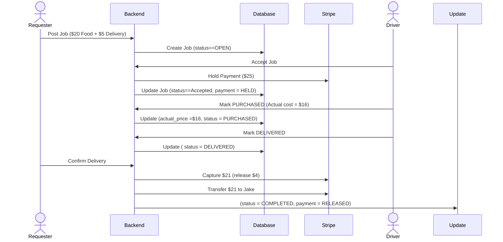

# Payment Flow Sequences
**Project:** Adelaide Uni Eats <br>
**Team:** Taishi Morgan, Sam Lotus <br>
**Version:** 1.0  <br>
**Date:**  22/01/2026

## 1. Overview
Payments will utilise the Escrow like behaviour visible in the payment platform Stripe to hold funds until the Requester confirms delivery of their product.

## 2. Succesful Delivery



## 3. Cancellation Flow

```mermaid
    sequenceDiagram
    actor Jake as Driver
    participant API as Backend
    participant Stripe as Stripe
    participant DB as Database
    actor Sarah as Requester

    Note over Jake,Sarah: Job Accepted, Payment Held

    Jake->>API: Cancel Job
    API->>Stripe: Refund $25
    API->>DB: Update (status=CANCELLED, payment=REFUNDED)
    API->>Sarah: "Refunded $25"
    ```

## 4. Price over budget

```mermaid
    sequenceDiagram
    actor Jake as Driver
    participant API as Backend
    actor Sarah as Requester

    Jake->>API: Mark as PURCHASED ($25)
    API->>Jake: ERROR: "Exceeds Budget ($20). Contact Requester Via Chat"

    Note over Jake,Sarah: Jake Messages Sarah Via Chat
    Jake->>Sarah: "The actual cost of the item was $25 not $20, can you please approve?"

    alt Sarah Approves
        Note over Sarah,Jake: "I'm going to repost this order so accept this new one"
        Sarah->>API: Manually cancel and repost with the updated $30 budget
        Note over Sarah: Creates new job with the updated budget
    else Sarah Declines
        Sarah->>API: Cancel job
        API->>Jake: "Job cancelled by the requester"
    end
    ```

    